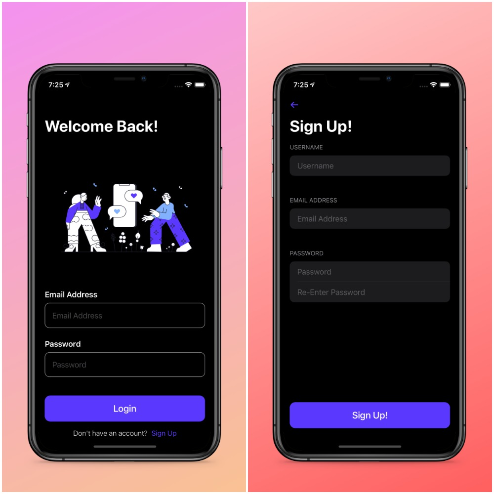
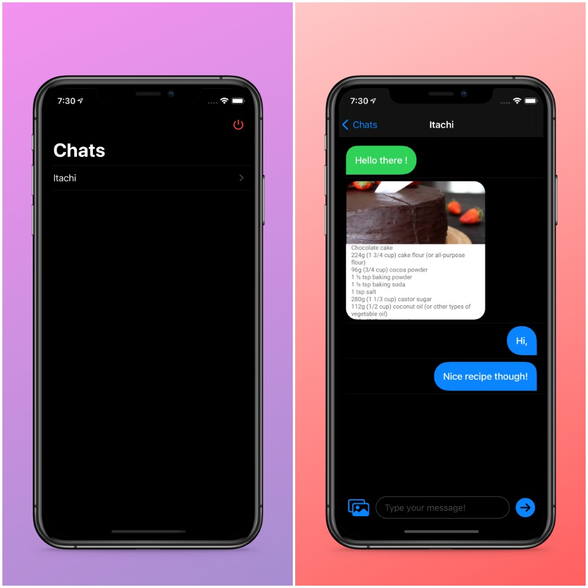

# Geo-Chat
#### A realtime Geo Chat Application made using SwiftUI where users can chat with other users  in their proximity anonymously

## Overview 💬
- Users can chat with other users who are in the proximiy of 1 mile anonymously
- Messages are stores in Firebase Realtime Database and images are stored in Firebase Storage
- Supports sharing of images as well.

## Screenshots 📷

 ## Installation 🛠
 - Clone / download this repository.
 - Change the bundle identifier in project settings.
 - Run the app.
 - <b> requires XCode 12.0 + <b>

 
## Frameworks
- Combine Framework ( Form Validation )
- Firebase Auth + Database + Storage (Chat Messages and Images)
- Custom Modifiers (Chat Bubbles)
- SDWebImage ( To load web images )
- Image picker  (For selecting Images)

 
## Author
* [Sai Nikhit Gulla](https://github.com/gsnsg)

## License

 Copyright 2021 Sai Nikhit Gulla.

 Licensed under MIT License: https://opensource.org/licenses/MIT
